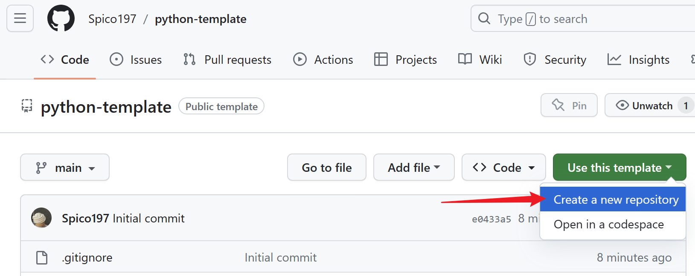

# 🗞️ python-template

A template for creating new Python projects.



## 🌴 Setup

```bash
$ git clone https://github.com/Spico197/python-template
$ cd python-template
$ pip install -r requirements.txt
$ conda install git  # update git if `pre-commit` fails
$ pre-commit install
```

## 💡 Features

- `make format` to automatically format code with `black` and `isort`
- `make test` to run tests with `pytest` and `flake8`, and generate converage report
- Use `pre-commit` to hook up `git commit` to format code automatically
