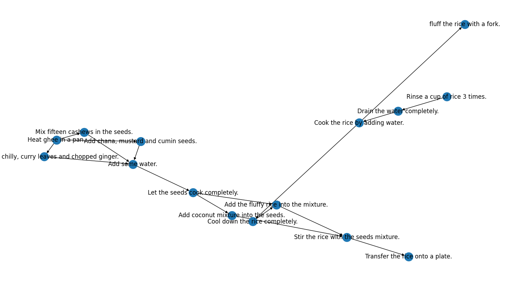
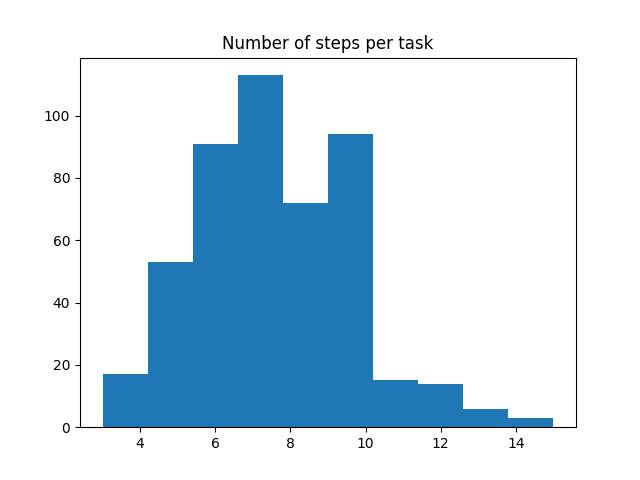
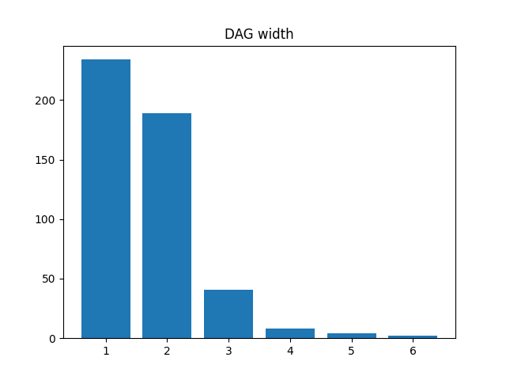

# 🛰️ TaskLAMA

This is an **unoffical** implementation of TaskLAMA.

🚧 Currently, this repo is under construction. Please don't take the results seriously.


## 📐 Data Statistics

Original data link: [[link]](https://storage.googleapis.com/gresearch/tasklama/tasklama.zip) . This data is licensed under CC-BY 4.0.

Huggingface data link: [[link]](https://huggingface.co/datasets/Spico/TaskLAMA) .

Below lists the statistics of the test data.

An complex example of "Task: ake coconut rice - Assumption: Making coconut rice with ghee. - 15 steps"

 .

|#Task|#Task w/ line-order steps|#Task w/ DAG-order steps|
|-:|-:|-:|
|478|341|137|






## 📜 Citation

```bibtex
@misc{yuan2023tasklama,
      title={TaskLAMA: Probing the Complex Task Understanding of Language Models}, 
      author={Quan Yuan and Mehran Kazemi and Xin Xu and Isaac Noble and Vaiva Imbrasaite and Deepak Ramachandran},
      year={2023},
      eprint={2308.15299},
      archivePrefix={arXiv},
      primaryClass={cs.CL}
}
```
